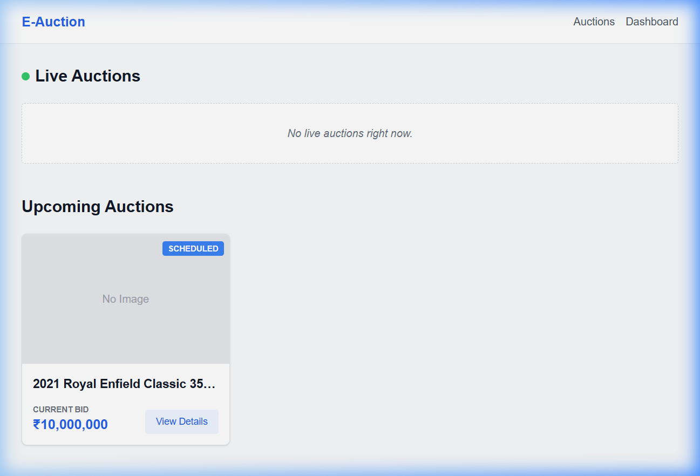
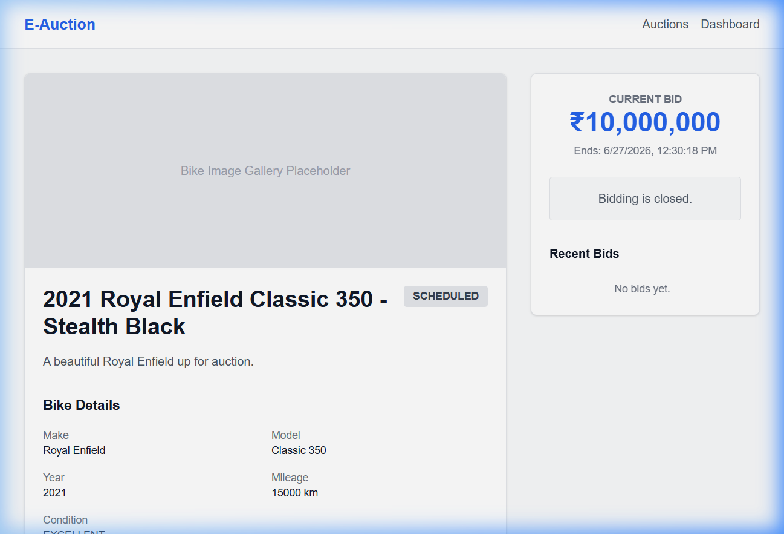
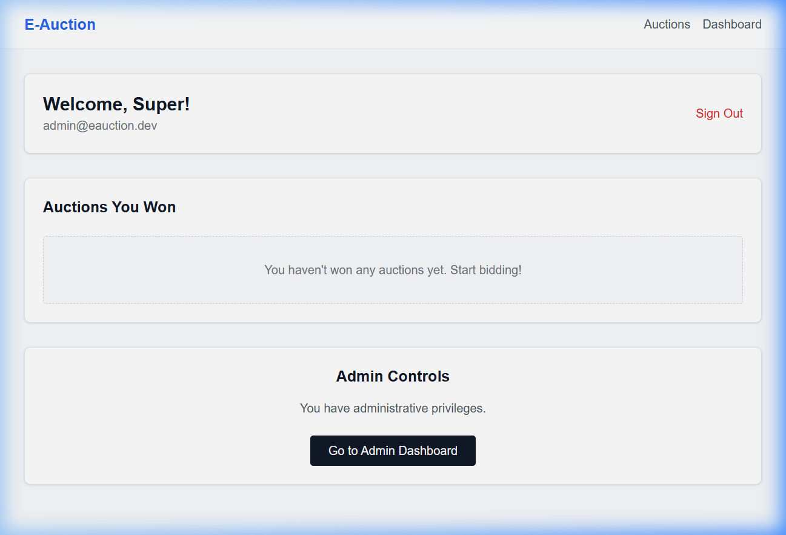

# E-Bike Auction Platform 🏍️

A full-stack, real-time auction platform for used motorcycles. Built with FastAPI on the backend and Next.js 14 on the frontend.

---

## 📸 Screenshots

### Home Page (Live Auctions)


### Auction Details (Real-time Bidding)


### Admin Dashboard


---

## 🚀 Overview

This platform was built to be simple, reliable, and highly functional without over-engineering. It uses a monolithic architecture because microservices would be overkill for this scale. Real-time concurrent bidding is handled securely via WebSockets, and all state is backed by PostgreSQL.

### Key Features
- **Real-Time Bidding:** Live websocket connections ensure all users see bids immediately.
- **Auto-Extension:** Auctions automatically extend if a bid is placed in the final minutes.
- **Role-Based Access Control:** Distinct views and capabilities for regular users vs. admins.
- **Robust Validation:** Strict server-side validation to prevent race conditions during concurrent bidding.

### Tech Stack
- **Backend:** Python 3.10+, FastAPI, PostgreSQL, Alembic, SQLAlchemy (Async)
- **Frontend:** Next.js 14 (App Router), Tailwind CSS, React Query
- **Infra:** Docker Compose

---

## 🛠️ Running Locally

The easiest way to get everything running is with Docker Compose.

```bash
docker-compose up --build
```
This spins up Postgres, the FastAPI backend (port `8000`), and the Next.js frontend (port `3000`).

### Test Data
Once the containers are up, you can seed the database with motorcycles and active auctions so you don't have to create them manually:

```bash
# In the apps/api directory
python -m scripts.seed
```

This creates the following default accounts:
- **Admin:** `admin@eauction.dev` / `Admin@123456`
- **User:** `user@eauction.dev` / `User@123456`

---

## ⚙️ Manual Setup (No Docker)

If you prefer running things natively on your host machine:

1. Ensure **PostgreSQL** is running and update `DATABASE_URL` in `apps/api/.env`.
2. Ensure **Node.js** (64-bit recommended) and **Python 3.10+** are installed.
3. Run backend migrations: `cd apps/api && alembic upgrade head`
4. Start backend: `cd apps/api && uvicorn app.main:app --reload --port 8000`
5. Start frontend: `cd apps/web && npm install && npm run dev`

---

## 📚 API Docs

When the backend is running, the interactive Swagger UI is available at:
👉 **[http://localhost:8000/docs](http://localhost:8000/docs)**

For a rough offline API reference, check out `docs/api.md`.
